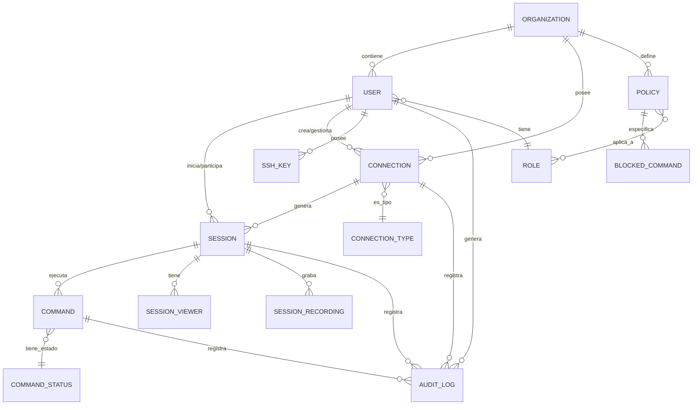

# Modelo de Datos - Trident SRA

## Diagrama de Relaciones



## Entidades Principales

### 1. USER (Usuario)

Representa a los usuarios del sistema con sus credenciales y permisos.

```typescript
interface User {
  id: string                    // UUID único
  email: string                 // Email único (login)
  password_hash: string         // Hash bcrypt de contraseña
  name: string                  // Nombre completo
  avatar_url?: string           // URL del avatar
  bio?: string                  // Biografía
  timezone: string              // Zona horaria (ej: "UTC-5")
  role_id: string              // FK a ROLE
  organization_id: string       // FK a ORGANIZATION
  is_active: boolean           // Estado activo/inactivo
  two_factor_enabled: boolean  // 2FA habilitado
  two_factor_secret?: string   // Secret para 2FA
  last_login?: Date            // Última sesión
  created_at: Date             // Fecha de creación
  updated_at: Date             // Última actualización
  deleted_at?: Date            // Soft delete
}
```

**Relaciones**:
- Pertenece a una ORGANIZATION
- Tiene un ROLE
- Crea múltiples CONNECTION
- Participa en múltiples SESSION
- Posee múltiples SSH_KEY
- Genera múltiples AUDIT_LOG

---

### 2. ROLE (Rol)

Define los roles y permisos en el sistema.

```typescript
interface Role {
  id: string                    // UUID único
  name: string                  // "Admin", "Technician", "Observer"
  description: string           // Descripción del rol
  permissions: Permission[]     // Array de permisos
  color: string                 // Color hex para UI (#5bc2e7)
  created_at: Date
  updated_at: Date
}

enum Permission {
  // Conexiones
  CREATE_CONNECTION = "connection:create",
  READ_CONNECTION = "connection:read",
  UPDATE_CONNECTION = "connection:update",
  DELETE_CONNECTION = "connection:delete",
  
  // Sesiones
  START_SESSION = "session:start",
  JOIN_SESSION = "session:join",
  VIEW_SESSION = "session:view",
  RECORD_SESSION = "session:record",
  END_SESSION = "session:end",
  
  // Usuarios
  CREATE_USER = "user:create",
  READ_USER = "user:read",
  UPDATE_USER = "user:update",
  DELETE_USER = "user:delete",
  MANAGE_ROLES = "user:manage_roles",
  
  // Auditoría
  VIEW_AUDIT = "audit:view",
  EXPORT_AUDIT = "audit:export",
  
  // Configuración
  MANAGE_SETTINGS = "settings:manage",
  MANAGE_POLICIES = "policies:manage",
}
```

**Roles Predefinidos**:
- **Admin**: Todos los permisos
- **Technician**: Gestión de conexiones y sesiones, visualización de usuarios
- **Observer**: Solo visualización (read-only)

---

### 3. ORGANIZATION (Organización)

Agrupa usuarios y recursos bajo una entidad organizacional.

```typescript
interface Organization {
  id: string                    // UUID único
  name: string                  // Nombre de la organización
  slug: string                  // Identificador URL-friendly
  domain?: string               // Dominio corporativo
  logo_url?: string            // Logo de la organización
  plan: "free" | "pro" | "enterprise"
  max_users: number            // Límite de usuarios
  max_connections: number      // Límite de conexiones
  settings: OrganizationSettings
  created_at: Date
  updated_at: Date
}

interface OrganizationSettings {
  session_timeout: number          // Tiempo de inactividad (ms)
  auto_record_sessions: boolean    // Grabar automáticamente
  require_2fa: boolean            // 2FA obligatorio
  allowed_ip_ranges?: string[]    // Rangos IP permitidos
  sso_enabled: boolean            // SSO habilitado
  sso_provider?: string           // "okta", "azure_ad", etc
}
```

---

### 4. CONNECTION (Conexión)

Representa una conexión configurada a un servidor remoto.

```typescript
interface Connection {
  id: string                    // UUID único
  name: string                  // Nombre descriptivo
  type: ConnectionType          // SSH, RDP, VNC
  hostname: string              // IP o dominio
  port: number                  // Puerto de conexión
  username: string              // Usuario para conectar
  
  // Autenticación
  auth_method: "password" | "ssh_key" | "certificate"
  password_encrypted?: string   // Contraseña encriptada
  ssh_key_id?: string          // FK a SSH_KEY
  certificate?: string          // Certificado
  
  // Metadata
  description?: string
  tags: string[]               // Tags para organización
  environment: "production" | "staging" | "development" | "test"
  
  // Relaciones
  organization_id: string       // FK a ORGANIZATION
  created_by_user_id: string   // FK a USER
  
  // Estado
  status: "active" | "inactive" | "archived"
  last_used?: Date             // Última vez usada
  total_sessions: number       // Contador de sesiones
  
  created_at: Date
  updated_at: Date
  deleted_at?: Date
}

enum ConnectionType {
  SSH = "ssh",      // Puerto 22
  RDP = "rdp",      // Puerto 3389
  VNC = "vnc",      // Puerto 5900+
  TELNET = "telnet" // Puerto 23
}
```

**Relaciones**:
- Pertenece a una ORGANIZATION
- Creada por un USER
- Genera múltiples SESSION
- Puede usar una SSH_KEY

---

### 5. SSH_KEY (Clave SSH)

Almacena claves SSH para autenticación en conexiones.

```typescript
interface SSHKey {
  id: string                    // UUID único
  name: string                  // Nombre descriptivo
  fingerprint: string           // Fingerprint SHA256
  public_key: string            // Clave pública
  private_key_encrypted: string // Clave privada encriptada
  passphrase_encrypted?: string // Passphrase encriptado
  
  user_id: string              // FK a USER
  organization_id: string       // FK a ORGANIZATION
  
  created_at: Date
  updated_at: Date
  last_used?: Date
  deleted_at?: Date
}
```

---

### 6. SESSION (Sesión)

Representa una sesión activa o histórica de conexión remota.

```typescript
interface Session {
  id: string                    // UUID único
  session_id: string            // ID público (ssh-1, rdp-2, etc)
  connection_id: string         // FK a CONNECTION
  
  // Usuario principal
  initiated_by_user_id: string  // FK a USER
  
  // Estado
  status: "active" | "ended" | "disconnected" | "error"
  
  // Tiempos
  started_at: Date
  ended_at?: Date
  duration_seconds?: number     // Calculado
  
  // Grabación
  is_recording: boolean
  recording_url?: string        // URL del video
  recording_size_bytes?: number
  
  // Estadísticas
  total_commands: number
  safe_commands: number
  blocked_commands: number
  
  // Metadata
  client_ip: string            // IP del cliente
  user_agent: string           // Navegador/cliente
  
  created_at: Date
  updated_at: Date
}
```

**Relaciones**:
- Pertenece a una CONNECTION
- Iniciada por un USER
- Tiene múltiples SESSION_VIEWER
- Ejecuta múltiples COMMAND
- Tiene SESSION_RECORDING

---

### 7. SESSION_VIEWER (Observador de Sesión)

Usuarios que están viendo/participando en una sesión.

```typescript
interface SessionViewer {
  id: string                    // UUID único
  session_id: string            // FK a SESSION
  user_id: string              // FK a USER
  
  role: "owner" | "collaborator" | "viewer"
  
  joined_at: Date
  left_at?: Date
  is_active: boolean
  
  // Permisos en la sesión
  can_type: boolean            // Puede escribir comandos
  can_see: boolean             // Puede ver terminal
  can_share: boolean           // Puede compartir sesión
}
```

---

### 8. COMMAND (Comando)

Registro de cada comando ejecutado en una sesión.

```typescript
interface Command {
  id: string                    // UUID único
  session_id: string            // FK a SESSION
  user_id: string              // FK a USER que lo ejecutó
  
  // Comando
  command: string              // Comando completo
  command_type: "shell" | "system" | "file" | "network" | "admin"
  
  // Estado
  status: CommandStatus        // ejecutado, bloqueado, error
  
  // Resultado
  output?: string              // Salida del comando
  exit_code?: number           // Código de salida (0 = éxito)
  error_message?: string       // Mensaje de error
  
  // Risk Assessment
  risk_level: "low" | "medium" | "high" | "critical"
  was_blocked: boolean
  blocked_reason?: string      // Por qué se bloqueó
  policy_id?: string           // FK a POLICY
  
  // Tiempos
  executed_at: Date
  duration_ms: number          // Duración de ejecución
  
  created_at: Date
}

enum CommandStatus {
  EXECUTED = "executed",       // Ejecutado exitosamente
  BLOCKED = "blocked",         // Bloqueado por política
  ERROR = "error",             // Error en ejecución
  TIMEOUT = "timeout"          // Timeout
}
```

---

### 9. POLICY (Política de Seguridad)

Define políticas y reglas de seguridad de la organización.

```typescript
interface Policy {
  id: string                    // UUID único
  name: string                  // Nombre de la política
  description: string
  organization_id: string       // FK a ORGANIZATION
  
  // Alcance
  is_active: boolean
  applies_to_roles: string[]   // Array de role_ids
  applies_to_connections: string[] // Array de connection_ids
  
  // Reglas
  blocked_commands: BlockedCommand[]
  allowed_commands?: string[]  // Whitelist (opcional)
  
  // Configuración
  require_approval: boolean    // Comandos requieren aprobación
  auto_disconnect_on_violation: boolean
  notify_on_violation: boolean
  
  created_by_user_id: string   // FK a USER
  created_at: Date
  updated_at: Date
}
```

---

### 10. BLOCKED_COMMAND (Comando Bloqueado)

Patrón de comando bloqueado por una política.

```typescript
interface BlockedCommand {
  id: string                    // UUID único
  policy_id: string            // FK a POLICY
  
  // Patrón
  pattern: string              // Regex o string exacto
  pattern_type: "exact" | "regex" | "contains"
  
  // Metadata
  name: string                 // Nombre descriptivo
  description: string          // Por qué está bloqueado
  severity: "low" | "medium" | "high" | "critical"
  
  // Ejemplos
  examples: string[]           // Ejemplos de comandos que bloquea
  
  // Para qué protocolos aplica
  applies_to_types: ConnectionType[]
  
  created_at: Date
  updated_at: Date
}
```

**Ejemplos de Comandos Bloqueados**:

```typescript
const dangerousCommands = [
  {
    pattern: "^rm\\s+-rf\\s+/",
    name: "Recursive Delete Root",
    severity: "critical",
    examples: ["rm -rf /", "rm -rf /*"]
  },
  {
    pattern: "^dd\\s+if=/dev/",
    name: "Disk Overwrite",
    severity: "critical",
    examples: ["dd if=/dev/zero of=/dev/sda"]
  },
  {
    pattern: "^mkfs\\.",
    name: "Format Filesystem",
    severity: "critical",
    examples: ["mkfs.ext4 /dev/sda1"]
  },
  {
    pattern: ":(\\)\\{\\s*:\\|:\\&\\s*\\};:",
    name: "Fork Bomb",
    severity: "critical",
    examples: [":(){ :|:& };:"]
  }
]
```

---

### 11. SESSION_RECORDING (Grabación de Sesión)

Metadata de las grabaciones de sesiones.

```typescript
interface SessionRecording {
  id: string                    // UUID único
  session_id: string            // FK a SESSION
  
  // Archivo
  file_url: string             // URL en storage (S3, etc)
  file_name: string
  file_size_bytes: number
  mime_type: string            // "video/webm", "application/cast"
  
  // Duración
  duration_seconds: number
  frames_per_second: number    // FPS
  
  // Metadata
  resolution: string           // "1920x1080"
  codec: string               // "h264", "vp9"
  
  // Estado
  status: "processing" | "ready" | "error"
  is_downloadable: boolean
  retention_until: Date        // Fecha de eliminación automática
  
  created_at: Date
  updated_at: Date
}
```

---

### 12. AUDIT_LOG (Registro de Auditoría)

Registro completo de todas las acciones en el sistema.

```typescript
interface AuditLog {
  id: string                    // UUID único
  
  // Contexto
  organization_id: string       // FK a ORGANIZATION
  user_id?: string             // FK a USER (puede ser sistema)
  session_id?: string          // FK a SESSION (si aplica)
  connection_id?: string       // FK a CONNECTION (si aplica)
  
  // Evento
  event_type: AuditEventType
  event_category: "auth" | "connection" | "session" | "user" | "system" | "security"
  action: string               // "login", "create", "delete", etc
  
  // Detalles
  description: string          // Descripción legible
  metadata: Record<string, any> // Datos adicionales JSON
  
  // Request Info
  ip_address: string
  user_agent: string
  
  // Resultado
  status: "success" | "failure" | "warning"
  error_message?: string
  
  timestamp: Date
  created_at: Date
}

enum AuditEventType {
  // Autenticación
  USER_LOGIN = "user.login",
  USER_LOGOUT = "user.logout",
  USER_LOGIN_FAILED = "user.login.failed",
  USER_2FA_ENABLED = "user.2fa.enabled",
  USER_PASSWORD_CHANGED = "user.password.changed",
  
  // Usuarios
  USER_CREATED = "user.created",
  USER_UPDATED = "user.updated",
  USER_DELETED = "user.deleted",
  USER_ROLE_CHANGED = "user.role.changed",
  
  // Conexiones
  CONNECTION_CREATED = "connection.created",
  CONNECTION_UPDATED = "connection.updated",
  CONNECTION_DELETED = "connection.deleted",
  CONNECTION_TESTED = "connection.tested",
  
  // Sesiones
  SESSION_STARTED = "session.started",
  SESSION_ENDED = "session.ended",
  SESSION_JOINED = "session.joined",
  SESSION_SHARED = "session.shared",
  SESSION_RECORDING_STARTED = "session.recording.started",
  SESSION_RECORDING_STOPPED = "session.recording.stopped",
  
  // Comandos
  COMMAND_EXECUTED = "command.executed",
  COMMAND_BLOCKED = "command.blocked",
  COMMAND_FAILED = "command.failed",
  
  // Políticas
  POLICY_CREATED = "policy.created",
  POLICY_UPDATED = "policy.updated",
  POLICY_DELETED = "policy.deleted",
  POLICY_VIOLATION = "policy.violation",
  
  // Seguridad
  SECURITY_ALERT = "security.alert",
  UNAUTHORIZED_ACCESS = "security.unauthorized",
  SUSPICIOUS_ACTIVITY = "security.suspicious",
}
```

---

## Índices y Optimización

### Índices Recomendados

```sql
-- USER
CREATE INDEX idx_user_email ON user(email);
CREATE INDEX idx_user_organization ON user(organization_id);
CREATE INDEX idx_user_role ON user(role_id);
CREATE INDEX idx_user_active ON user(is_active) WHERE is_active = true;

-- CONNECTION
CREATE INDEX idx_connection_organization ON connection(organization_id);
CREATE INDEX idx_connection_type ON connection(type);
CREATE INDEX idx_connection_status ON connection(status);
CREATE INDEX idx_connection_created_by ON connection(created_by_user_id);

-- SESSION
CREATE INDEX idx_session_connection ON session(connection_id);
CREATE INDEX idx_session_user ON session(initiated_by_user_id);
CREATE INDEX idx_session_status ON session(status);
CREATE INDEX idx_session_started_at ON session(started_at DESC);
CREATE INDEX idx_session_active ON session(status) WHERE status = 'active';

-- COMMAND
CREATE INDEX idx_command_session ON command(session_id);
CREATE INDEX idx_command_user ON command(user_id);
CREATE INDEX idx_command_blocked ON command(was_blocked) WHERE was_blocked = true;
CREATE INDEX idx_command_executed_at ON command(executed_at DESC);

-- AUDIT_LOG
CREATE INDEX idx_audit_organization ON audit_log(organization_id);
CREATE INDEX idx_audit_user ON audit_log(user_id);
CREATE INDEX idx_audit_event_type ON audit_log(event_type);
CREATE INDEX idx_audit_timestamp ON audit_log(timestamp DESC);
CREATE INDEX idx_audit_category ON audit_log(event_category);
```

---

## Relaciones Clave

### 1. Usuario → Sesión → Comandos
```
USER (inicia) → SESSION → COMMAND (ejecuta)
```
Un usuario inicia una sesión en una conexión y ejecuta múltiples comandos.

### 2. Organización → Política → Comando Bloqueado
```
ORGANIZATION → POLICY → BLOCKED_COMMAND → COMMAND (valida)
```
La organización define políticas que contienen comandos bloqueados que se validan contra los comandos ejecutados.

### 3. Sesión Colaborativa
```
SESSION ← SESSION_VIEWER → USER
```
Múltiples usuarios pueden ver/participar en una misma sesión con diferentes roles.

### 4. Auditoría Completa
```
USER/SESSION/CONNECTION/COMMAND → AUDIT_LOG
```
Todas las entidades principales generan registros de auditoría.

---

## Reglas de Negocio

### 1. Permisos por Rol

| Acción | Admin | Technician | Observer |
|--------|-------|------------|----------|
| Crear conexión | ✅ | ✅ | ❌ |
| Editar conexión | ✅ | ✅ | ❌ |
| Eliminar conexión | ✅ | ⚠️ Solo propias | ❌ |
| Iniciar sesión | ✅ | ✅ | ❌ |
| Unirse a sesión | ✅ | ✅ | ✅ |
| Ver sesión | ✅ | ✅ | ✅ |
| Ejecutar comandos | ✅ | ✅ | ❌ |
| Terminar sesión | ✅ | ⚠️ Solo propias | ❌ |
| Crear usuario | ✅ | ❌ | ❌ |
| Ver usuarios | ✅ | ✅ | ✅ |
| Editar usuario | ✅ | ❌ | ❌ |
| Ver auditoría | ✅ | ✅ | ✅ |
| Exportar auditoría | ✅ | ❌ | ❌ |
| Gestionar políticas | ✅ | ❌ | ❌ |

### 2. Estados de Sesión

```
[Inactive] → [Active] → [Ended]
                ↓
          [Disconnected] → [Active] (reconexión)
                ↓
             [Error]
```

### 3. Validación de Comandos

```
Comando ingresado
    ↓
Verificar contra POLICY
    ↓
¿Comando bloqueado?
    ├─ SÍ → Rechazar + Log + Alerta
    └─ NO → Ejecutar + Log
```

### 4. Retención de Datos

- **Sesiones activas**: Permanente
- **Grabaciones**: 90 días (configurable)
- **Audit logs**: 1 año (configurable)
- **Comandos**: 180 días (configurable)

---

## Escalabilidad

### Particionamiento

**AUDIT_LOG**: Particionar por timestamp (mensual)
```sql
PARTITION BY RANGE (MONTH(timestamp))
```

**COMMAND**: Particionar por executed_at (semanal)
```sql
PARTITION BY RANGE (WEEK(executed_at))
```

**SESSION_RECORDING**: Almacenar en object storage (S3, Azure Blob)

### Caché

- **USER**: Cache de sesión (Redis) - TTL 1h
- **CONNECTION**: Cache de conexiones activas - TTL 5min
- **POLICY**: Cache de políticas - TTL 15min
- **ROLE**: Cache de roles y permisos - TTL 1h

---

**Versión del Modelo**: 1.0.0  
**Última Actualización**: Octubre 2025

